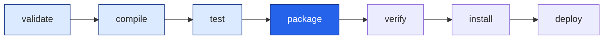
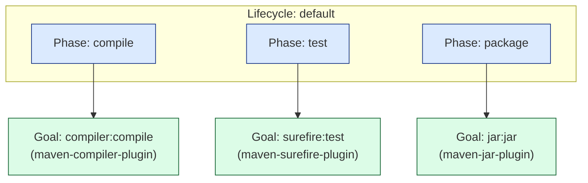

# Guía de las Fases (Phases) en Maven

> Guía conceptual para entender cómo funciona Maven por dentro: qué es un *lifecycle*, qué es una *phase* y qué es un *goal*, y cómo se relacionan entre sí.

---

## 1. La idea en una analogía: hacer un pastel 🎂

Antes de hablar de Maven, pensemos en una **receta de cocina**.

Para hacer un pastel sigues unos pasos **en orden**:

```
1. Mezclar  →  2. Hornear  →  3. Decorar  →  4. Servir
```

No puedes decorar antes de hornear. **El orden importa.**

Maven funciona igual: tiene una "receta" con pasos ordenados para construir tu proyecto. Esa receta tiene un nombre técnico: **lifecycle** (ciclo de vida).

| En la cocina | En Maven |
|---|---|
| La receta completa | **Lifecycle** (ciclo de vida) |
| Cada paso de la receta (Mezclar, Hornear…) | **Phase** (fase) |
| La acción concreta de un paso (batir, meter al horno…) | **Goal** (objetivo) |
| El cocinero que sabe hacer la acción | **Plugin** |

Con esta tabla en mente, todo lo demás es detalle.

---

## 2. El Lifecycle: la receta completa

Un **lifecycle** es una secuencia ordenada de fases. Maven trae **tres** lifecycles integrados:

| Lifecycle | ¿Para qué sirve? |
|---|---|
| `default` | Construir y desplegar el proyecto (compilar, probar, empaquetar, instalar…) |
| `clean`   | Limpiar lo generado en construcciones anteriores (borrar `target/`) |
| `site`    | Generar la documentación/sitio web del proyecto |

El que usarás el 90% del tiempo es **`default`**.

---

## 3. Las Phases: los pasos de la receta

Una **phase** (fase) es un paso *con nombre* dentro del lifecycle. El lifecycle `default` tiene varias; estas son las más importantes que debes conocer:

| Phase | ¿Qué representa? |
|---|---|
| `validate`    | Verifica que el proyecto es correcto y tiene todo lo necesario |
| `compile`     | Compila el código fuente (`.java` → `.class`) |
| `test`        | Ejecuta las pruebas unitarias |
| `package`     | Empaqueta el código compilado (por ejemplo, en un `.jar`) |
| `verify`      | Corre verificaciones de calidad sobre el paquete |
| `install`     | Instala el paquete en tu repositorio **local** (`~/.m2`) |
| `deploy`      | Publica el paquete en un repositorio **remoto** (compartido) |

### 🔑 La Regla de Oro

> **Cuando pides una fase, Maven ejecuta TODAS las fases anteriores primero, en orden.**

Es como decirle al cocinero *"¡decora el pastel!"*: él sabe que primero tiene que mezclar y hornear, así que hace todo hasta llegar a decorar.

Por eso, si ejecutas:

```bash
mvn package
```

Maven **no** empaqueta directamente. Hace, en orden:

```
validate → compile → test → package
```

Y solo entonces tienes tu `.jar` listo.



> En el diagrama: si pides `package` (en azul fuerte), Maven recorre todas las fases a su izquierda automáticamente. Las de la derecha (`verify`, `install`, `deploy`) **no** se ejecutan, porque vienen después.

---

## 4. Los Goals: la acción real de cada paso

Aquí está el detalle que confunde a todos al principio:

> Una **phase**, por sí sola, **no hace nada**. Es solo un *momento* en la receta.

El trabajo de verdad lo hace un **goal** (objetivo): la acción concreta que un *plugin* sabe ejecutar.

```
PHASE "compile"  →  contiene el  →  GOAL "compiler:compile"
   (el momento)                       (la acción que de verdad compila)
```

Cada fase tiene uno o más goals "pegados" (enlazados) a ella. Cuando Maven llega a una fase, ejecuta los goals que esa fase tenga enlazados.

| Phase | Goal que se ejecuta (ejemplo) | Plugin responsable |
|---|---|---|
| `compile` | `compiler:compile` | maven-compiler-plugin |
| `test`    | `surefire:test`     | maven-surefire-plugin |
| `package` | `jar:jar`           | maven-jar-plugin |
| `clean`   | `clean:clean`       | maven-clean-plugin |



---

## 5. Phase vs Goal: la diferencia, en una frase

| | Pregunta que responde | Es como… |
|---|---|---|
| **Phase** 🟦 | *¿En qué momento de la receta estamos?* | El paso (Mezclar, Hornear) |
| **Goal** 🟩 | *¿Qué tarea exacta se hace en ese momento?* | La acción (batir, meter al horno) |

- Una **phase** es el *momento*.
- Un **goal** es la *acción*.
- Un momento puede tener varias acciones enlazadas.

---

## 6. Las dos formas de invocar Maven

### A) Invocar una PHASE → ejecuta esa fase y todas las anteriores

```bash
mvn test
# Ejecuta: validate → compile → test
```

Útil cuando quieres "dejar el proyecto listo hasta cierto punto".

### B) Invocar un GOAL directamente → ejecuta SOLO esa acción

La sintaxis es `plugin:goal`:

```bash
mvn compiler:compile
# Ejecuta SOLO la compilación. No corre las fases anteriores.
```

> ⚠️ **Cuidado:** por eso `mvn jar:jar` puede fallar si antes no compilaste; el goal `jar:jar` empaqueta, pero no se encarga de compilar.

### C) Mezclar fases y goals en un mismo comando

Se ejecutan **en el orden en que los escribes**:

```bash
mvn clean package
# 1) clean   → borra target/  (limpia lo viejo)
# 2) package → compila, prueba y empaqueta desde cero
```

Este `mvn clean package` es, probablemente, el comando que más usarás en tu vida con Maven.

---

## 7. Errores mentales típicos (y cómo evitarlos)

- ❌ *"`package` es un comando que crea el jar."*
  ✅ `package` es una **fase**; crear el jar lo hace el **goal** `jar:jar` enlazado a ella.

- ❌ *"`clean` es lo mismo que la fase de limpiar."*
  ✅ Ojo: `clean` es una **fase** del lifecycle `clean`, y `clean:clean` es el **goal**. Se llaman igual pero no son lo mismo.

- ❌ *"Si pido `test`, solo prueba."*
  ✅ Pide `test` y Maven primero **compila** (y valida), porque no puede probar sin compilar.

---

## 8. Chuleta final (para imprimir 🧲)

```
LIFECYCLE  =  la receta completa        (default, clean, site)
   │
   └── PHASE  =  un paso de la receta    (compile, test, package…)
          │
          └── GOAL  =  la acción real     (compiler:compile, surefire:test…)
                 │
                 └── lo provee un PLUGIN  (maven-compiler-plugin…)

REGLA DE ORO:  pedir una fase ejecuta TODAS las fases anteriores.

Comandos clave:
  mvn compile          → compila
  mvn test             → compila + prueba
  mvn package          → compila + prueba + empaqueta (.jar)
  mvn clean package    → limpia y reconstruye desde cero   ⭐ el más usado
  mvn compiler:compile → ejecuta SOLO ese goal (sintaxis plugin:goal)
```

---

### Referencia

- Documentación oficial: *Introduction to the Build Lifecycle* — Apache Maven.
